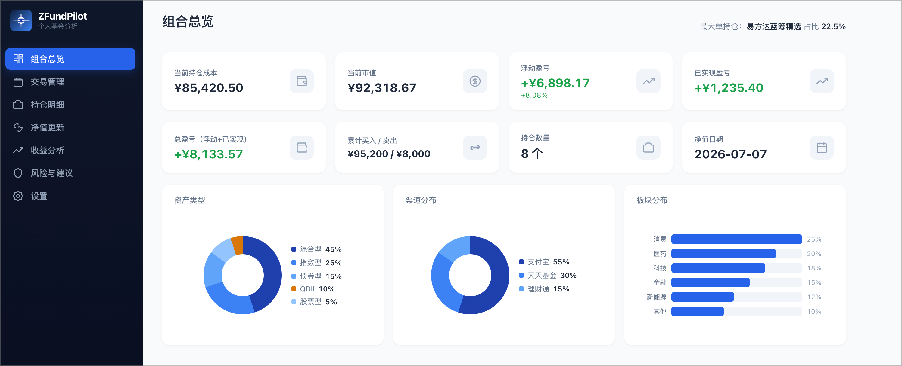
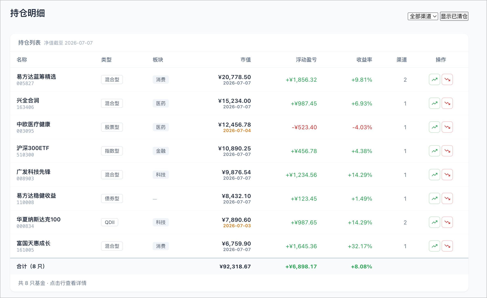

<div align="center">

> 🌐 **简体中文** | [English](README_EN.md)


# ZFundPilot

**个人基金分析与风险管理系统**

本地运行 · 自动更新净值 · 计算收益与风险 · 组合结构优化建议

[](LICENSE)
[](https://www.python.org/)
[](https://react.dev/)
[](https://fastapi.tiangolo.com/)
[](https://github.com/Euzohn/ZFundPilot/commits)

</div>

> ⚠️ 仅用于数据分析与风险管理，不做自动交易、不预测涨跌、不构成任何投资建议。
>
> 🚧 本项目处于活跃开发阶段。功能可能会发生变化，某些功能也可能会失效。如果您遇到问题或有好的想法，请[提交 Issue](https://github.com/Euzohn/ZFundPilot/issues)。欢迎贡献代码！

---

## 截图

<div align="center">
  
  <p><b>组合总览</b> — 持仓成本、市值、盈亏一览 + 资产/渠道/板块分布图</p>
  <br>
  
  <p><b>持仓明细</b> — 按基金合并的跨渠道持仓视图，净值日期标注新鲜度</p>
</div>

## 目录

- [截图](#截图)
- [功能](#功能)
- [环境要求](#环境要求)
- [安装](#安装)
- [部署](#部署)
- [环境变量](#环境变量)
- [使用流程](#使用流程)
- [CSV 列说明](#csv-列说明交易流水)
- [技术栈](#技术栈)
- [项目结构](#项目结构)
- [数据模型](#数据模型)
- [风险阈值](#风险阈值)
- [更新日志](#更新日志)
- [贡献](#贡献)
- [License](#license)
- [Star History](#star-history)

## 功能

- 📊 **交易流水管理**：记录每一笔买入/卖出（定投、加仓、减仓、赎回），以及现金分红/红利再投资，表单录入 + CSV 批量导入/导出
- 🏦 **多渠道支持**：支付宝、理财通、天天基金等，同一基金不同渠道分开计算成本
- 💸 **手续费自动查询**：录入交易时自动从天天基金拉取申购/赎回费率，按金额分档匹配（优惠折扣价），卖出按 FIFO 先进先出匹配买入批次计算赎回费，支持手动覆盖
- 📈 **持仓自动汇总**：按「基金 + 渠道」用移动加权平均成本法汇总，卖出时结转已实现收益
- 🔄 **净值更新**：AkShare 优先，天天基金兜底，输入代码自动获取名称/类型/板块
- 💰 **收益分析**：浮动盈亏、已实现盈亏、组合收益曲线（累计收益 + 收益率 + 图例切换）、收益率排序、日历视图、按渠道堆叠柱状图
- 🛡️ **风险分析**：最大回撤、年化波动率、集中度（HHI）、结构占比、风险提示
- ⚖️ **结构建议**：基于组合结构给出再平衡建议（非交易指令）
- 🤖 **AI 投顾对话**：配置 OpenAI 兼容 API 后，AI 自动联网搜索最新资讯 + 结合持仓数据给出调仓建议（支持智谱 / Kimi / 通义千问 / DeepSeek）；多对话管理、日期-时间命名 + 自定义重命名、AI 帮你录入交易（含手续费自动计算）、token 用量统计
- 📉 **净值走势图标记**：在净值曲线上自动标记买入/卖出点位，悬停显示交易明细
- 🎨 **渠道颜色自定义**：预设色板 + 自由选色，服务端同步
- 🔑 **关键词映射自定义**：板块/类型分类规则开放给用户编辑，自定义关键词优先匹配，多设备同步
- ⚙️ **偏好设置同步**：购买渠道顺序、关键词映射、渠道颜色等偏好存储在服务端，多设备统一
- 🏠 **首页门户**：深色主题全屏门户页，品牌展示 + 核心指标 + 快捷入口 + GitHub 链接
- 📱 **移动端适配**：抽屉式侧边栏导航、响应式网格布局
- 🎨 **涨跌颜色切换**：支持「绿涨红跌（国际惯例）」/「红涨绿跌（A 股惯例）」双主题，服务端同步
- 🔐 **密码认证**：用户名 + 密码双因素登录，HMAC 签名 token，支持设置页在线修改用户名与密码（SHA-256 哈希存储）

## 环境要求

- Python 3.10+

## 安装

```bash
pip install -e .
```

开发模式（含测试与代码检查）：

```bash
pip install -e ".[dev]"
```

若 akshare 安装失败，可用国内镜像：

```bash
pip install akshare -i http://mirrors.aliyun.com/pypi/simple/ --trusted-host=mirrors.aliyun.com --upgrade
```

> macOS 上如遇 `SSL: CERTIFICATE_VERIFY_FAILED`，运行一次
> `/Applications/Python\ 3.x/Install\ Certificates.command` 即可修复。

## 部署

> 详细部署方式（开发/生产/Docker）见 [DEPLOY.md](DEPLOY.md)

### 方式零：Docker（最快）

```bash
docker-compose up -d --build
```

浏览器打开 http://localhost:8000

### 方式一：React 前端 + FastAPI 后端（推荐）

```bash
# 后端 API（终端 1）
uvicorn zfundpilot.api:app --reload --port 8000

# 前端开发服务器（终端 2）
cd frontend && npm install && npm run dev
```

浏览器打开 http://localhost:5173

### 方式二：生产模式（单进程，前端构建后由后端统一服务）

```bash
cd frontend && npm install && npm run build && cd ..
uvicorn zfundpilot.api:app --host 0.0.0.0 --port 8000
```

浏览器打开 http://localhost:8000

## 环境变量

| 变量 | 默认值 | 说明 |
|------|--------|------|
| `ZFUNDPILOT_USERNAME` | `admin` | **仅首次启动**时用于初始化登录用户名，之后用户名存在 `data/auth.json`，可通过设置页修改 |
| `ZFUNDPILOT_PASSWORD` | 空 | **仅首次启动**时用于初始化密码哈希，之后密码存在 `data/auth.json`，可通过设置页修改 |
| `ZFUNDPILOT_SECRET` | 自动生成 | **仅首次启动**时用于初始化 token 签名密钥，之后存于 `data/auth.json` |
| `ZFUNDPILOT_NAV_CRON` | `0 21 * * 1-5` | 净值定时更新 cron 表达式（工作日 21:00），可在设置页面暂停/启用 |
| `ZFUNDPILOT_HOME` | 项目根 | 数据目录（`data/`）所在位置 |

## 使用流程

1. **交易录入 → 单笔录入**：输入基金代码点「获取基金信息」自动补全，选择买入/卖出/分红/再投资、渠道，
    填必要信息后保存
    - 分红只需填写到账金额；再投资填写红利份额 + 净值，金额自动计算
    - 买入/卖出的手续费会自动从天天基金查询费率并预填（可手动修改）
    - 或 **CSV 导入/导出**：下载模板，填好流水后上传，可自动补全基金信息
2. **净值更新**：点「更新全部基金净值」拉取历史净值，页面展示待更新/已更新状态
3. **持仓明细**：查看按「基金+渠道」拆分的持仓，以及跨渠道合并视图
4. **收益分析 / 风险与建议**：查看收益曲线、浮动/已实现盈亏、风险指标与结构建议
5. **AI 助手**：配置 API 后可对话咨询、录入交易（AI 自动查费率）
6. **设置 → 偏好设置**：自定义购买渠道顺序、板块/类型关键词映射（多设备同步）

> 买入填金额（净值自动填充，份额自动倒算），卖出填份额（金额自动倒算），分红填金额，再投资填份额+净值。净值支持自动查询回填。

## CSV 列说明（交易流水）

| 列名 | 说明 | 必填 |
|------|------|------|
| fund_code | 基金代码 | ✅ |
| action | 操作：买入/卖出/分红/再投资（也识别 buy/sell/dividend/reinvest/申购/赎回/定投/红利再投资） | ✅ |
| date | 成交日期 YYYY-MM-DD | ✅ |
| amount | 成交金额 | 买入/分红必填，卖出可自动计算 |
| shares | 成交份额 | 卖出/再投资必填，买入可自动计算 |
| nav | 成交净值 | 导入时填二缺一可自动补全 |
| fee | 手续费 | |
| channel | 渠道：支付宝/理财通/天天基金等 | |
| note | 备注 | |

`amount` / `shares` / `nav` 三列中填写任意两列即可，导入时自动补全第三列。支持中文表头（如「基金代码」「操作」「渠道」）。

## 技术栈

| 层 | 技术 |
|---|---|
| 前端 | React 18 + Vite + TypeScript + Tailwind + shadcn/ui |
| 后端 | FastAPI + SQLite + Pandas |
| 数据源 | AkShare + 天天基金 |
| AI | OpenAI 兼容 API（智谱 / Kimi / 通义千问 / DeepSeek） |
| 部署 | Docker / Uvicorn |

## 项目结构

```text
ZFundPilot/
├── pyproject.toml        # 打包配置、依赖、Ruff/Pytest 配置
├── Dockerfile            # 多阶段构建 Docker 镜像（内置 TZ=Asia/Shanghai）
├── docker-compose.yml    # Docker 部署（端口由 override 指定）
├── src/zfundpilot/       # Python 包
│   ├── __init__.py
│   ├── config.py         # 全局配置、渠道、风险阈值、认证/AI 配置存储
│   ├── models.py         # 数据结构（Fund / Transaction / Position）
│   ├── db.py             # SQLite 数据库操作
│   ├── fetch_fund.py     # 净值获取 + 名称/类型/板块识别 + 费率查询 + 关键词映射
│   ├── analysis.py       # 交易流水汇总、收益计算、组合曲线
│   ├── risk.py           # 风险分析（回撤/波动率/集中度/结构占比）
│   ├── rebalance.py      # 结构优化建议
│   ├── data_io.py        # 交易流水 CSV 导入/导出
│   ├── api.py            # FastAPI REST API（35+ 路由 + 认证中间件）
│   └── ai.py             # AI 投顾对话（持仓上下文 + 联网搜索 + LLM 流式调用）
├── tests/                # Pytest 测试套件（34 测试）
├── data/
│   ├── fund.db           # SQLite 数据库（自动生成）
│   ├── auth.json         # 用户名 / 密码哈希 / token 密钥（自动生成）
│   ├── ai_config.json    # AI 模型配置（自动生成）
│   └── sector_map.json   # 基金代码→板块映射（自动维护）
├── frontend/             # React + Vite + TypeScript + Tailwind + shadcn/ui
│   ├── src/
│   │   ├── pages/        # 10 个页面（Home / Overview / Transactions / Positions / FundDetail / NavUpdate / Returns / Risk / AIChat / Settings / Login）
│   │   ├── components/   # Layout + shadcn/ui + Logo + LogoSpinner + PnLCalendar + FeeBreakdownCard
│   │   ├── api/          # 类型化 API client + streamChat (SSE)
│   │   └── lib/          # 工具函数（format / auth / channels / channelColors / colorTheme / useApi）
│   └── dist/             # 构建产物（生产模式）
└── .env.example           # 环境变量模板
```

## 数据模型

- **funds**：基金基础信息（代码/名称/类型/板块）
- **transactions**：交易流水（买入/卖出/分红/再投资/金额/份额/净值/手续费/渠道）
  - 现金分红计入已实现收益，份额和持仓成本不变
  - 红利再投资增加份额和持仓成本，同时计入已实现收益，总盈亏不变
- **nav_history**：基金净值历史
- **ai_usage**：AI 对话 token 用量记录（模型/入 token/出 token/轮数）
- **preferences**：用户偏好设置（购买渠道、自定义关键词映射、渠道颜色、涨跌颜色主题），多设备同步
- 持仓不单独存表，由交易流水按「基金 + 渠道」实时汇总计算（移动加权平均成本法）
- 旧版 holdings 表会在首次启动时自动迁移为交易流水

## 风险阈值

默认阈值定义在 `config.py` 的 `RiskThresholds`，可按需调整：

| 指标 | 默认阈值 |
|------|---------|
| 单基金占比偏高 / 过高 | 20% / 40% |
| 债券最低占比 | 10% |
| QDII 海外暴露 | 30% |
| 权益类偏重 | 70% |
| 高风险回撤 | -15% |
| 高波动率 | 25% |

## 更新日志

详见 [CHANGELOG.md](CHANGELOG.md)。

## 贡献

欢迎提交 [Issues](https://github.com/Euzohn/ZFundPilot/issues) 报告问题或提出新需求，
也欢迎提交 [Pull Requests](https://github.com/Euzohn/ZFundPilot/pulls) 一起改进。

**作者邮箱**：Zongid@outlook.com

## License

[MIT License](LICENSE) © 2025 Euzohn

---

## Star History

[](https://star-history.com/#Euzohn/ZFundPilot&Date)
