<div align="center">

> 🌐 **简体中文** | [English](README_EN.md)

<p align="center">
  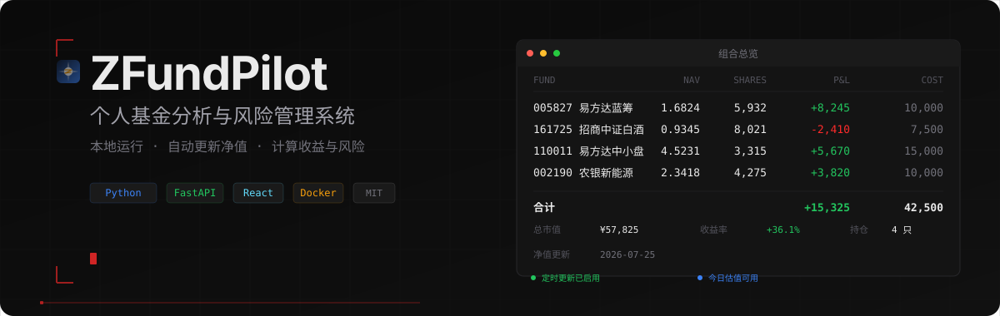
</p>

</div>

> ⚠️ 仅用于数据分析与风险管理，不做自动交易、不预测涨跌、不构成任何投资建议。
>
> 🚧 本项目处于活跃开发阶段。功能可能会发生变化，某些功能也可能会失效。如果您遇到问题或有好的想法，请[提交 Issue](https://github.com/Euzohn/ZFundPilot/issues)。欢迎贡献代码！

---

## 截图

<div align="center">
  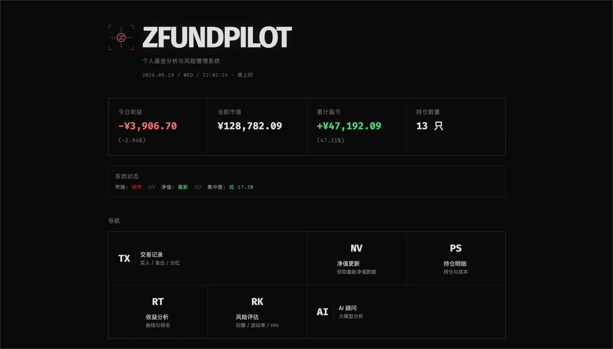
  <p><b>首页门户</b> — 深色战术终端风格，核心指标 + 快捷导航 + 系统状态</p>
  <br>
  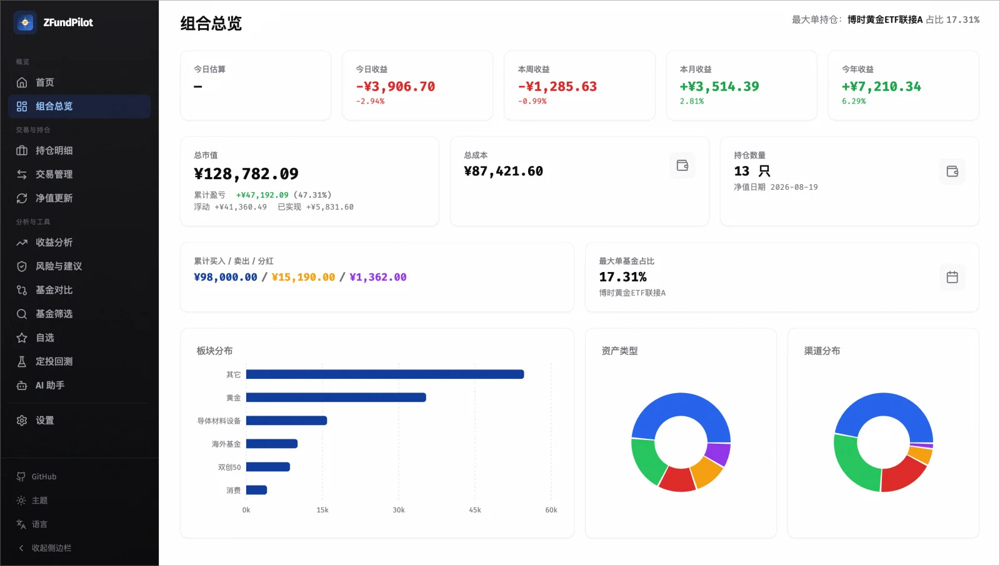
  <p><b>组合总览</b> — 持仓成本、市值、盈亏一览 + 资产/渠道/板块分布图</p>
  <br>
  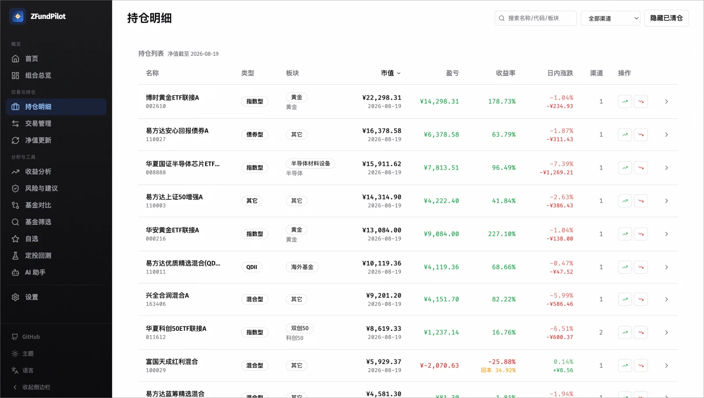
  <p><b>持仓明细</b> — 按基金合并的跨渠道持仓视图，净值日期标注新鲜度</p>
  <br>
  <details>
<summary>更多截图（点击展开）</summary>

  <br>
  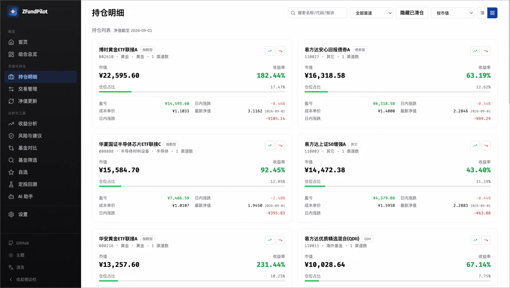
  <p><b>持仓明细（网格视图）</b> — Bento 大卡布局，占比条 + 成本/估值/盈亏 + 持仓天数/板块</p>
  <br>
  <table>
    <tr>
      <td>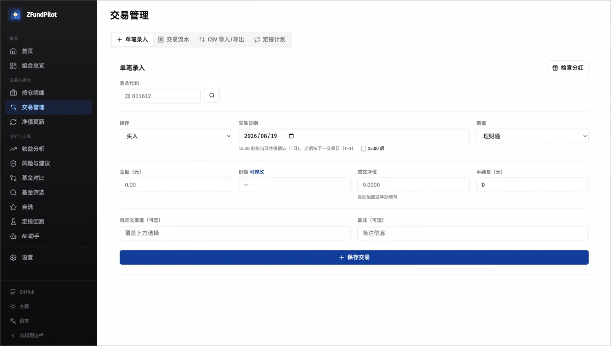</td>
      <td>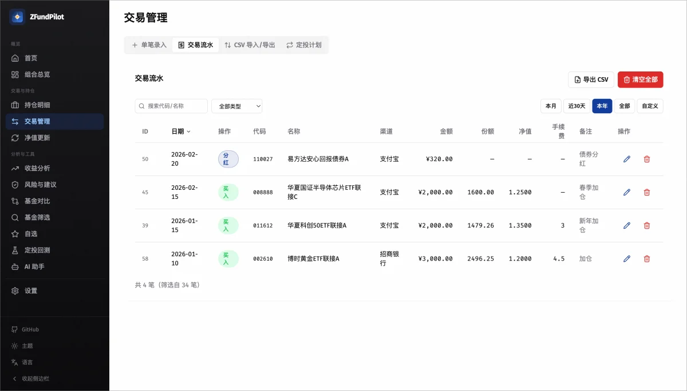</td>
    </tr>
    <tr>
      <td>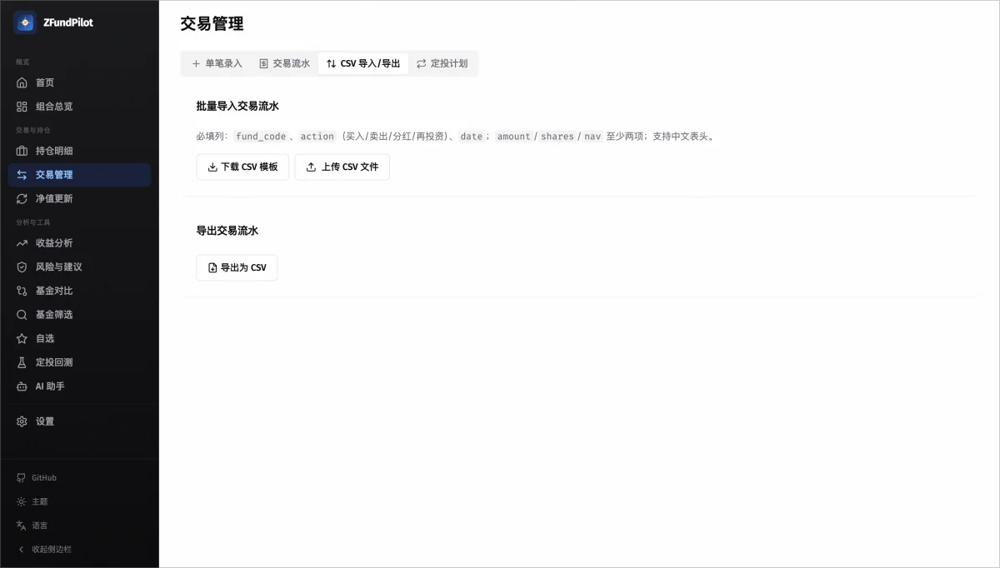</td>
      <td>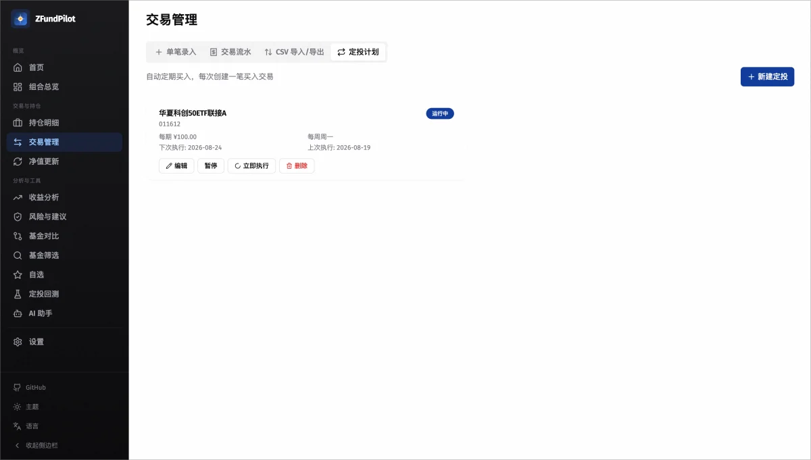</td>
    </tr>
  </table>
  <p><b>交易管理</b> — 交易录入、流水查看、CSV 导入导出、截图导入（AI 视觉模型识别交易/持仓）、定投计划自动执行</p>
  <br>
  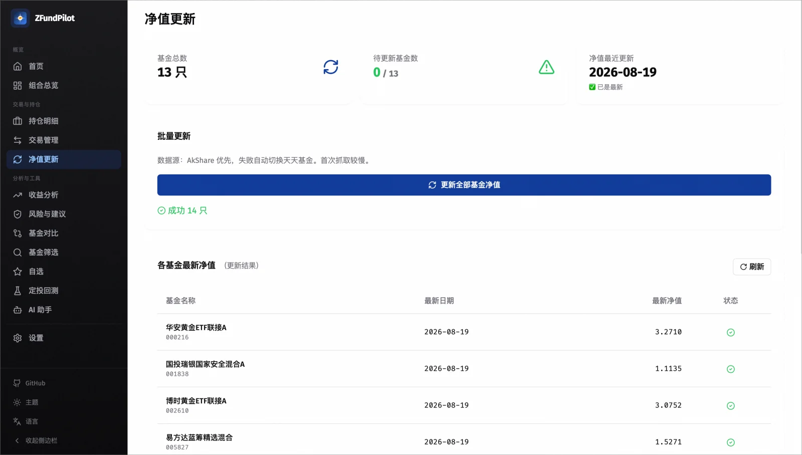
  <p><b>净值更新</b> — AkShare 优先、天天基金兜底，批量拉取净值历史</p>
  <br>
  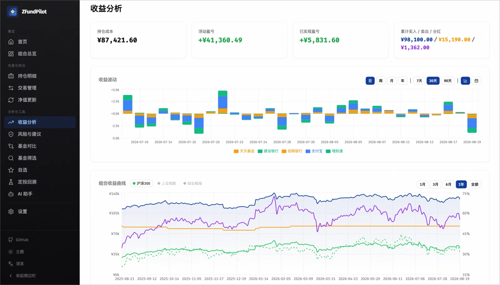
  <p><b>收益分析</b> — 浮动/已实现盈亏、组合收益曲线、基准对比、日/周/月/年日历视图</p>
  <br>
  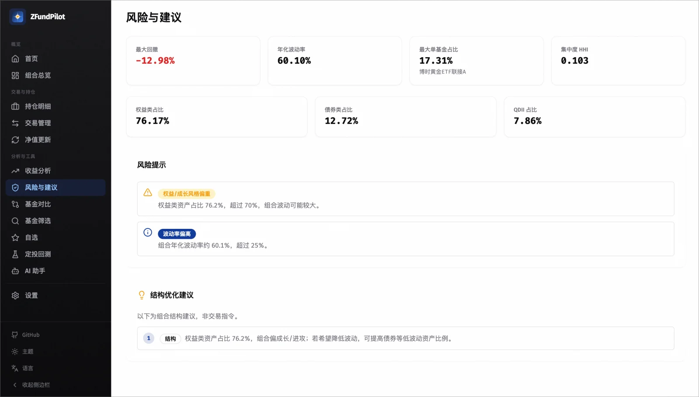
  <p><b>风险评估</b> — 最大回撤、年化波动率、集中度 HHI、结构占比</p>
  <br>
  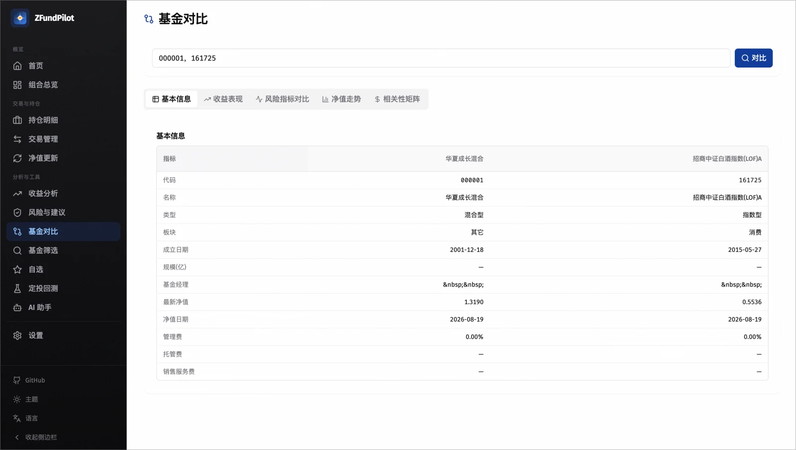
  <p><b>基金对比</b> — 多维度同框对比 + 净值走势叠加 + 相关性矩阵</p>
  <br>
  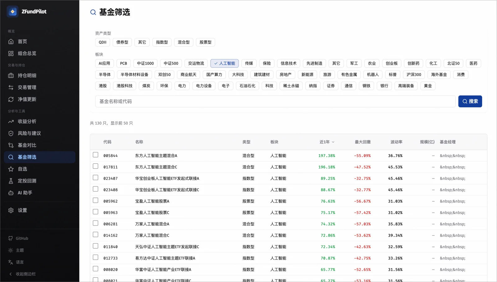
  <p><b>基金筛选</b> — 全市场筛选 + Top 30 指标增强，列头可排序</p>
  <br>
  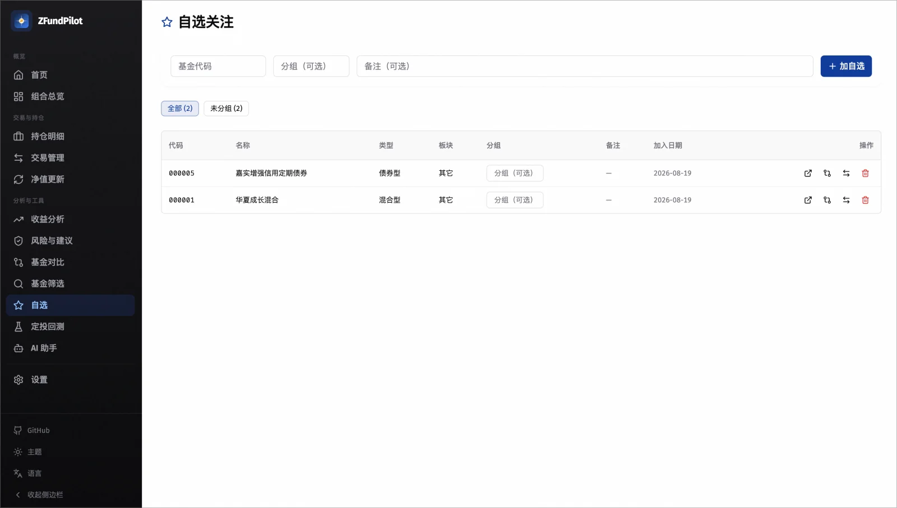
  <p><b>自选关注</b> — 追踪关注基金，已持有的标「持仓中」badge，列头可排序</p>
  <br>
  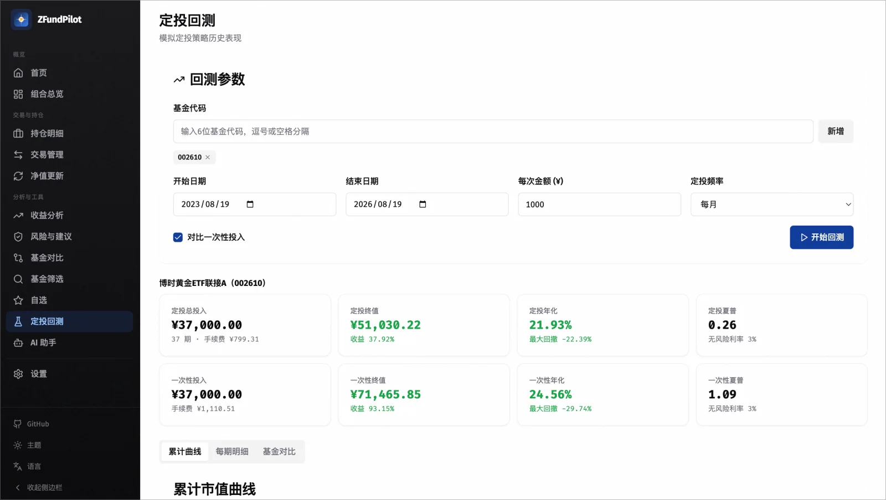
  <p><b>定投回测</b> — DCA vs 一次性投入，XIRR 年化、最大回撤、夏普比率</p>
  <br>
  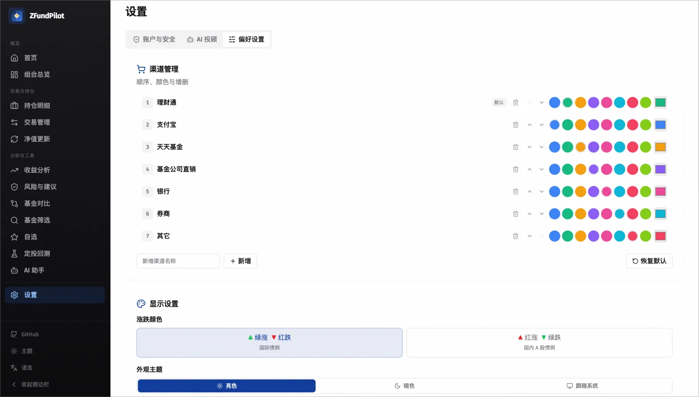
  <p><b>设置</b> — 账户管理、AI 配置、偏好设置、审计日志</p>

</details>
</div>

## 这是什么

ZFundPilot 是一个**自托管的中国基金组合分析工具**。记录每一笔交易，自动拉取净值，计算收益与风险，给出结构优化建议。不是交易系统，不做自动买卖，不连接券商。

## 为什么不同

- **自托管，数据归你** — 本地运行或 Docker 部署，数据存在自己手里，不上传任何第三方
- **中国市场专精** — 数据源来自 AkShare 和天天基金，支持中国基金的全维度分析（含实时估值、费率计算、板块分类）
- **数据驱动分析** — 不是荐基平台，没有排行榜和营销话术，只有基于你持仓数据的量化指标
- **AI 辅助，不是 AI 决策** — OpenAI 兼容 API 提供持仓上下文问答，建议仅供参考，决策在你自己

## 快速开始

### Docker（最快）

```bash
docker compose up -d --build
```

浏览器打开 http://localhost:8000

### 本地开发

```bash
# 后端 API
pip install -e .
uvicorn zfundpilot.api:app --reload --port 8000

# 前端开发服务器（另一个终端）
cd frontend && npm install && npm run dev
```

详细部署指南见 [DEPLOY.md](DEPLOY.md)。

## 功能亮点

### 交易与持仓

- **交易流水管理** — 记录买入/卖出/分红/再投资/转换，表单录入 + CSV 批量导入/导出 + 全量数据备份导出 ZIP
- **基金转换** — 一次录入转出基金（卖出）和转入基金（买入），原子创建两条关联交易，转出份额带持有量校验，赎回费/申购费分别自动计算，转换记录在流水中带标识
- **多渠道支持** — 支付宝、理财通、天天基金等，同一基金不同渠道分开计算成本
- **手续费自动查询** — 录入交易时自动从天天基金拉取申购/赎回费率，按金额分档匹配，卖出按 FIFO 计算赎回费，支持手动覆盖
- **持仓自动汇总** — 按「基金 + 渠道」用移动加权平均成本法汇总，卖出时结转已实现收益
- **持仓明细视图** — 列表视图（跨渠道明细 + 净值新鲜度）与网格视图（Bento 大卡 + 占比条 + 成本/估值/盈亏/持仓天数/板块）自由切换

### 分析与估值

- **净值更新** — AkShare 优先，天天基金兜底，输入代码自动获取名称/类型/板块
- **收益分析** — 浮动盈亏、已实现盈亏、组合收益曲线、基准对比（沪深300/上证指数/创业板指，数据持久化离线可用）、收益率排序、日/周/月/年日历视图、按渠道堆叠柱状图
- **实时估值** — 交易日实时估算基金涨跌幅，组合估算 P&L 一目了然，真实净值公布后自动失效。主源无数据时自动走天天基金 fundgz 替补（6 线程并行），指数/ETF 行情兜底
- **基金对比** — 多维度同框对比 + 净值走势叠加 + 相关性矩阵。对比篮全局管理，随时增减，导航栏显示数量 badge
- **基金筛选器** — 从全市场基金池按类型/板块/关键词筛选，Top 30 自动补充收益/风险指标，列头可排序，一键加入对比或自选
- **自选关注列表** — 追踪关注基金，已持有的自动标「持仓中」badge，列头可排序，添加代码自动获取名称/类型/板块，快捷跳转详情/对比/买入
- **截图导入** — 上传购买记录或持仓截图，AI 视觉模型自动识别交易/持仓。持仓对账模式按渠道对比已记录份额，一键生成差额调整交易。视觉模型独立配置（智谱 GLM-4V / 通义千问 VL / GPT-4o / Kimi 视觉），截图只有名称时自动匹配代码
- **基金详情** — 净值走势 + 资产配置饼图 + 前十大重仓股 + 同类排名走势 + 基金档案（基金经理/规模/成立时间）+ 风险等级 + 顶栏快捷入口（加入对比/自选/买入/卖出/定投）
- **定投策略回测** — 指定基金 + 时间区间 + 频率（月/双周/周），用历史净值回测定投 vs 一次性投入，计算 XIRR 年化、最大回撤、夏普比率
- **定投计划自动执行** — 设置每日/每周/每双周/每月自动买入，遇非交易日顺延，自动计算手续费，T+1 回填净值

### 风险与优化

- **风险分析** — 最大回撤、年化波动率、集中度（HHI）、结构占比、风险提示
- **结构建议** — 基于组合结构给出再平衡建议（非交易指令）
- **止盈止损提醒** — 净值更新后自动检查持仓收益率，达到阈值时生成提醒。状态机防重复：触发后需收益率回落到复位线以下才再次提醒，避免部分止盈后重复骚扰。止盈/止损独立开关，全局阈值可配置。确认跳转交易页预填卖出
- **分红自动检测** — 每天 09:30 自动扫描持仓基金分红事件，弹窗预填确认入账。幽灵提醒自动清理：源数据修正后自动标记无效提醒为 ignored

### AI 辅助

- **AI 投顾对话** — 配置 OpenAI 兼容 API（智谱/Kimi/通义千问/DeepSeek），AI 自动联网搜索最新资讯 + 结合持仓数据给出调仓建议
- **AI 录入交易** — 自然语言描述交易，AI 自动解析结构化数据并计算手续费，确认后写入

### 安全与自定义

- **密码认证** — 用户名 + 密码登录，HMAC 签名 token，bcrypt 密码哈希，登录速率限制防爆破
- **API Key 加密存储** — AI API key 落盘自动加密（Fernet AES-128-CBC + HMAC-SHA256）
- **审计日志** — 敏感操作记入日志，设置页可查看
- **中英文切换** — 全站界面支持中英文切换，侧边栏一键切换，数据格式（¥/$、相对时间）自动适配
- **涨跌颜色切换** — 支持「绿涨红跌（国际）」/「红涨红跌（A 股）」双主题，服务端同步
- **暗色模式** — light/dark/system 三态切换，默认跟随系统偏好
- **渠道颜色自定义** — 预设色板 + 自由选色，服务端同步
- **关键词映射自定义** — 板块/类型分类规则开放给用户编辑，多设备同步

## 使用流程

1. **交易录入** → 输入基金代码，自动补全信息，选择操作类型和渠道，保存
2. **净值更新** → 点击「更新全部基金净值」拉取历史数据，或启用定时任务自动更新
3. **持仓与分析** → 查看持仓明细、收益曲线、风险指标与结构建议
4. **AI 辅助** → 配置 API 后对话咨询，或让 AI 帮你录入交易

> 买入填金额（净值自动填充，份额自动倒算），卖出填份额（金额自动倒算），分红填金额，再投资填份额+净值。

## 技术栈

| 层 | 技术 |
|---|---|
| 前端 | React 18 + Vite + TypeScript + Tailwind + shadcn/ui |
| 后端 | FastAPI + SQLite + Pandas |
| 数据源 | AkShare + 天天基金 |
| AI | OpenAI 兼容 API（智谱 / Kimi / 通义千问 / DeepSeek） |
| 部署 | Docker / Uvicorn |

## 项目结构

<details>
<summary>点击展开</summary>

```text
ZFundPilot/
├── pyproject.toml        # 打包配置、依赖、Ruff/Pytest 配置
├── Dockerfile            # 多阶段构建 Docker 镜像（内置 TZ=Asia/Shanghai）
├── docker-compose.yml    # Docker 部署（端口由 override 指定）
├── .github/workflows/    # GitHub Actions CI/CD
│   └── ci.yml            #   ruff → pytest → tsc → build
├── src/zfundpilot/       # Python 包
│   ├── __init__.py
│   ├── config.py         # 全局配置、渠道、风险阈值、认证/AI 配置存储
│   ├── models.py         # 数据结构（Fund / Transaction / Position）
│   ├── db.py             # SQLite 数据库操作
│   ├── fetch_fund.py     # 净值获取 + 名称/类型/板块识别 + 费率查询 + 关键词映射 + 持仓/排名/档案
│   ├── fetch_estimate.py # 基金实时估值（AkShare fund_value_estimation_em）
│   ├── compare.py        # 基金对比（收益率/风险/相关性多维度计算）
│   ├── fund_filter.py    # 基金筛选器（全市场池加载 + 多条件筛选 + 指标增强 Top 30）
│   ├── analysis.py       # 交易流水汇总、收益计算、组合曲线
│   ├── risk.py           # 风险分析（回撤/波动率/集中度/结构占比）
│   ├── rebalance.py      # 结构优化建议
│   ├── backtest.py       # 定投策略回测
│   ├── auto_invest.py    # 定投计划自动执行
│   ├── crypto.py         # 敏感字段加密（Fernet）
│   ├── data_io.py        # CSV 导入/导出 + 全量备份 ZIP
│   ├── api.py            # FastAPI REST API（37+ 路由 + 认证中间件）
│   ├── ai.py             # AI 投顾对话（持仓上下文 + 联网搜索 + LLM 流式调用）
│   └── scheduler.py      # APScheduler 定时净值更新 + 定投执行 + 分红检测 + 止盈止损检查
├── tests/                # Pytest 测试套件（390 个用例）
│   ├── conftest.py       #   共享 fixtures
│   └── test_*.py         #   9 个测试模块
├── data/
│   ├── fund.db           # SQLite 数据库（自动生成）
│   ├── auth.json         # 用户名 / 密码哈希 / token 密钥（自动生成）
│   ├── ai_config.json    # AI 模型配置（自动生成）
│   └── sector_map.json   # 基金代码→板块映射（自动维护）
├── frontend/             # React + Vite + TypeScript + Tailwind + shadcn/ui
│   ├── src/
│   │   ├── pages/        # 13 个页面
│   │   ├── components/   # Layout + shadcn/ui + 业务组件
│   │   ├── i18n/         # LanguageContext + zh.ts + en.ts 翻译文件
│   │   ├── api/          # 类型化 API client + streamChat (SSE)
│   │   └── lib/          # 工具函数（format/actionLabels/rangeLabels 按 lang 切换）
│   └── dist/             # 构建产物（生产模式）
├── assets/readme/        # README 视觉素材
└── .env.example           # 环境变量模板
```

</details>

## 环境变量

<details>
<summary>点击展开</summary>

| 变量 | 默认值 | 说明 |
|------|--------|------|
| `ZFUNDPILOT_USERNAME` | `admin` | 仅首次启动时初始化登录用户名 |
| `ZFUNDPILOT_PASSWORD` | 空 | 仅首次启动时初始化密码哈希（bcrypt） |
| `ZFUNDPILOT_SECRET` | 自动生成 | 仅首次启动时初始化 token 签名密钥 |
| `ZFUNDPILOT_NAV_CRON` | `0 21 * * 1-5` | 净值定时更新 cron 表达式 |
| `ZFUNDPILOT_HOME` | 项目根 | 数据目录所在位置 |
| `ZFUNDPILOT_TRUSTED_PROXIES` | 空 | 信任代理网段（仅 Nginx/Caddy 反代后配置） |
| `CONTAINER_NAME` | `zfundpilot` | Docker 容器名称，多实例部署时需为每个实例设置不同名称（详见 DEPLOY.md） |

</details>

## 安全

<details>
<summary>点击展开</summary>

| 措施 | 说明 |
|------|------|
| 密码哈希 | bcrypt（cost=12），兼容旧版 SHA-256，登录后自动升级 |
| 登录限流 | 5 分钟内失败 5 次锁定 15 分钟 |
| Token 认证 | HMAC-SHA256 签名，7 天有效期，改密后立即失效 |
| 错误脱敏 | AI 上游错误不暴露给客户端 |
| 信任代理 | `ZFUNDPILOT_TRUSTED_PROXIES` 控制，默认空（不信任任何代理） |

- **纯 IP / 局域网**：设密码即可，默认配置安全
- **域名 + HTTPS**：推荐 Caddy 自动 TLS，配置 `TRUSTED_PROXIES`

</details>

## CSV 列说明（交易流水）

<details>
<summary>点击展开</summary>

| 列名 | 说明 | 必填 |
|------|------|------|
| fund_code | 基金代码 | ✅ |
| action | 操作类型（买入/卖出/分红/再投资，也识别 buy/sell/dividend/reinvest） | ✅ |
| date | 成交日期 YYYY-MM-DD | ✅ |
| amount | 成交金额 | 买入/分红必填 |
| shares | 成交份额 | 卖出/再投资必填 |
| nav | 成交净值 | 填二缺一可自动补全 |
| fee | 手续费 | |
| channel | 渠道 | |
| note | 备注 | |

`amount` / `shares` / `nav` 填写任意两列即可，自动补全第三列。支持中文表头。

</details>

## 风险阈值

<details>
<summary>点击展开</summary>

| 指标 | 默认阈值 |
|------|---------|
| 单基金占比偏高 / 过高 | 20% / 40% |
| 债券最低占比 | 10% |
| QDII 海外暴露 | 30% |
| 权益类偏重 | 70% |
| 高风险回撤 | -15% |
| 高波动率 | 25% |

默认阈值定义在 `config.py` 的 `RiskThresholds`，可按需调整。

</details>

## 更新日志

详见 [CHANGELOG.md](CHANGELOG.md)。

## 贡献

欢迎提交 [Issues](https://github.com/Euzohn/ZFundPilot/issues) 报告问题或提出新需求，也欢迎提交 [Pull Requests](https://github.com/Euzohn/ZFundPilot/pulls) 一起改进。

**作者邮箱**：[Zongid@outlook.com](mailto:Zongid@outlook.com)

## License

MIT License © 2025 Euzohn

数据来源与合规声明见 [NOTICE.md](./NOTICE.md)。

---

## Star History

[](https://star-history.com/#Euzohn/ZFundPilot&Date)