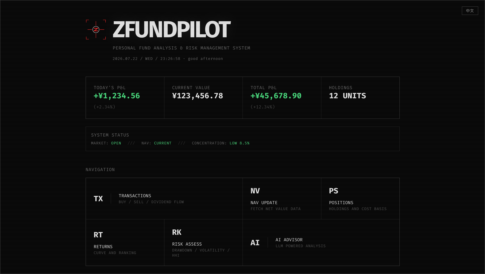

<div align="center">

> 🌐 [简体中文](README.md) | **English**


# ZFundPilot

**Personal Fund Analysis & Risk Management System**

Local-first · Auto NAV updates · Return & risk analytics · Portfolio rebalancing advice

[](LICENSE)
[](https://www.python.org/)
[](https://react.dev/)
[](https://fastapi.tiangolo.com/)
[](https://github.com/Euzohn/ZFundPilot/commits)

</div>

> ⚠️ For data analysis and risk management only. No automated trading, no price predictions, no investment advice.
>
> 🚧 This project is under active development. Features may change and some may break. If you encounter issues or have ideas, please [submit an Issue](https://github.com/Euzohn/ZFundPilot/issues). Contributions welcome!

---

## Screenshots

<div align="center">
  
  <p><b>Home Portal</b> — Dark tactical terminal style, key metrics + quick navigation + system status</p>
  <br>
  
  <p><b>Portfolio Overview</b> — Cost, market value, P&L at a glance + asset/channel/sector distribution charts</p>
  <br>
  
  <p><b>Positions</b> — Cross-channel merged view per fund, with NAV freshness indicator</p>
</div>

## Table of Contents

- [Screenshots](#screenshots)
- [Features](#features)
- [Requirements](#requirements)
- [Installation](#installation)
- [Deployment](#deployment)
- [Environment Variables](#environment-variables)
- [Usage Guide](#usage-guide)
- [CSV Column Reference](#csv-column-reference-transactions)
- [Tech Stack](#tech-stack)
- [Project Structure](#project-structure)
- [Data Model](#data-model)
- [Risk Thresholds](#risk-thresholds)
- [Changelog](#changelog)
- [Contributing](#contributing)
- [License](#license)
- [Star History](#star-history)

## Features

- 📊 **Transaction Management**: Record every buy/sell (DCA, add, reduce, redeem), cash dividend, and dividend reinvestment. Form-based entry + CSV bulk import/export
- 🏦 **Multi-Channel Support**: Alipay, WeChat, Tiantian Fund, etc. Same fund across different channels tracked separately
- 💸 **Auto Fee Lookup**: Automatically fetches purchase/redemption fee rates from Tiantian Fund when entering transactions. Matches fee tiers by amount (discounted rates), uses FIFO to match buy lots for redemption fees. Manual override supported
- 📈 **Auto Portfolio Aggregation**: Aggregates by fund + channel using moving weighted average cost. Realized P&L transferred on sell
- 🔄 **NAV Updates**: AkShare primary, Tiantian Fund fallback. Auto-fetch fund name/type/sector on code entry
- 💰 **Return Analysis**: Unrealized/realized P&L, portfolio return curve (cumulative profit + return rate + legend toggle), return rate ranking, calendar view, stacked bar by channel
- 📊 **Real-time Estimates**: Live fund change estimates during trading hours (Tiantian Fund fundgz API). Portfolio estimated P&L at a glance. Auto-invalidates when actual NAV is published
- 🔬 **Fund Compare**: Multi-dimensional side-by-side comparison (basic info, fees, scale, manager) + NAV curve overlay + correlation matrix for fund selection
- 🔍 **Fund Filter**: Filter candidate funds from the full market universe by type/sector/keyword, add to comparison with one click
- 🛡️ **Risk Analysis**: Max drawdown, annualized volatility, concentration (HHI), structure breakdown, risk flags
- ⚖️ **Rebalancing Advice**: Structure-based optimization suggestions (not trading signals)
- 🤖 **AI Advisor Chat**: Configure any OpenAI-compatible API for AI-powered advice with web search + portfolio context (supports Zhipu / Kimi / Qwen / DeepSeek). Multi-conversation management, date-time naming + custom rename, AI-assisted transaction entry (with auto fee calculation), token usage tracking
- 📉 **NAV Chart Markers**: Buy/sell points auto-marked on NAV curve, hover for transaction details
- 🎨 **Channel Color Customization**: Preset palette + custom color picker, synced server-side
- 🔑 **Custom Keyword Mapping**: Sector/type classification rules are user-editable. Custom keywords take priority. Synced across devices
- ⚙️ **Preference Sync**: Channel order, keyword mappings, channel colors, and other preferences stored server-side for multi-device consistency
- 🏠 **Home Portal**: Dark-themed full-screen portal page with branding, key metrics, quick actions, and GitHub link
- 📱 **Mobile Responsive**: Drawer-style sidebar navigation, responsive grid layout
- 🎨 **Color Theme Switch**: Toggle between "Green-up/Red-down (International)" and "Red-up/Green-down (A-share)". Synced server-side
- 🌓 **Dark Mode**: light / dark / system three-way toggle, defaults to system preference, can be manually locked in Settings, all pages adapted for both modes
- 🔐 **Password Auth**: Username + password login, HMAC-signed token, bcrypt password hashing. In-app username and password changes with login rate limiting

## Requirements

- Python 3.10+

## Installation

```bash
pip install -e .
```

Development mode (with tests and linting):

```bash
pip install -e ".[dev]"
```

If akshare installation fails, try a China mirror:

```bash
pip install akshare -i http://mirrors.aliyun.com/pypi/simple/ --trusted-host=mirrors.aliyun.com --upgrade
```

> On macOS, if you encounter `SSL: CERTIFICATE_VERIFY_FAILED`, run
> `/Applications/Python\ 3.x/Install\ Certificates.command` once to fix.

## Deployment

> Detailed deployment guide (dev/prod/Docker) see [DEPLOY.md](DEPLOY.md)

### Option 0: Docker (Fastest)

```bash
docker-compose up -d --build
```

Open http://localhost:8000

### Option 1: React Frontend + FastAPI Backend (Recommended)

```bash
# Backend API (Terminal 1)
uvicorn zfundpilot.api:app --reload --port 8000

# Frontend dev server (Terminal 2)
cd frontend && npm install && npm run dev
```

Open http://localhost:5173

### Option 2: Production Mode (Single process, frontend served by backend)

```bash
cd frontend && npm install && npm run build && cd ..
uvicorn zfundpilot.api:app --host 0.0.0.0 --port 8000
```

Open http://localhost:8000

## Environment Variables

| Variable | Default | Description |
|----------|---------|-------------|
| `ZFUNDPILOT_USERNAME` | `admin` | Used **only on first launch** to initialize login username. Afterwards stored in `data/auth.json`, changeable via Settings page |
| `ZFUNDPILOT_PASSWORD` | empty | Used **only on first launch** to initialize password hash (bcrypt). Afterwards stored in `data/auth.json`, changeable via Settings page |
| `ZFUNDPILOT_SECRET` | auto-generated | Used **only on first launch** to initialize token signing key. Afterwards stored in `data/auth.json` |
| `ZFUNDPILOT_NAV_CRON` | `0 21 * * 1-5` | Cron expression for scheduled NAV updates (weekdays 21:00). Can be paused/enabled in Settings |
| `ZFUNDPILOT_HOME` | project root | Location of the `data/` directory |
| `ZFUNDPILOT_TRUSTED_PROXIES` | empty | Trusted proxy CIDRs (comma-separated). Only needed when behind a reverse proxy (Nginx/Caddy) |

## Security

| Measure | Description |
|---------|-------------|
| Password Hashing | bcrypt (cost=12), backward-compatible with SHA-256, auto-upgraded on login |
| Login Rate Limiting | 5 failed attempts within 5 min → 15 min lockout. Supports X-Forwarded-For via trusted proxy config |
| Audit Log | Sensitive operations logged to `audit_log` table, viewable in Settings |
| Token Auth | HMAC-SHA256 signed tokens, 7-day expiry, invalidated on password change |
| Error Sanitization | Upstream AI errors logged server-side, never exposed to client |
| Trusted Proxy | `ZFUNDPILOT_TRUSTED_PROXIES` controls X-Forwarded-For trust. Empty by default (no proxy) |

### Deployment Modes

- **IP-only / LAN**: Set a password. Default config is safe (leave `TRUSTED_PROXIES` empty)
- **Domain + HTTPS**: Use Caddy for automatic TLS. Configure `TRUSTED_PROXIES` for correct client IP detection

## Usage Guide

1. **Transactions → Single Entry**: Enter fund code, click "Fetch Fund Info" for auto-complete. Select buy/sell/dividend/reinvest, channel, fill required fields, save
   - Dividend: only enter cash amount; Reinvest: enter shares + NAV, amount auto-calculated
   - Buy/sell fees are auto-looked up from Tiantian Fund and pre-filled (manually editable)
   - Or **CSV Import/Export**: Download template, fill in transactions, upload with auto fund info lookup
2. **NAV Update**: Click "Update All NAV" to fetch historical NAV data. Page shows pending/updated status
3. **Positions**: View positions split by fund + channel, plus cross-channel merged view
4. **Returns / Risk & Advice**: View return curves, unrealized/realized P&L, risk metrics and structural advice
5. **AI Assistant**: Configure API to chat for advice and entry transactions (AI auto-looks up fees)
6. **Settings → Preferences**: Customize channel order, sector/type keyword mappings (multi-device synced)

> Buy: enter amount (NAV auto-filled, shares auto-calculated). Sell: enter shares (amount auto-calculated). Dividend: enter amount. Reinvest: enter shares + NAV. NAV supports auto-lookup and backfill.

## CSV Column Reference (Transactions)

| Column | Description | Required |
|--------|-------------|----------|
| fund_code | Fund code | ✅ |
| action | buy/sell/dividend/reinvest (also accepts Chinese: 买入/卖出/分红/再投资/申购/赎回/定投/红利再投资) | ✅ |
| date | Trade date YYYY-MM-DD | ✅ |
| amount | Trade amount | Required for buy/dividend, auto-calculated for sell |
| shares | Trade shares | Required for sell/reinvest, auto-calculated for buy |
| nav | NAV at trade | Auto-filled if two of three are provided |
| fee | Transaction fee | |
| channel | Channel: Alipay/WeChat/Tiantian Fund etc. | |
| note | Note | |

Any two of `amount` / `shares` / `nav` can be provided; the third is auto-calculated on import. Chinese headers supported (e.g. 「基金代码」「操作」「渠道」).

## Tech Stack

| Layer | Technology |
|---|---|
| Frontend | React 18 + Vite + TypeScript + Tailwind + shadcn/ui |
| Backend | FastAPI + SQLite + Pandas |
| Data Source | AkShare + Tiantian Fund |
| AI | OpenAI-compatible API (Zhipu / Kimi / Qwen / DeepSeek) |
| Deployment | Docker / Uvicorn |

## Project Structure

```text
ZFundPilot/
├── pyproject.toml        # Package config, dependencies, Ruff/Pytest config
├── Dockerfile            # Multi-stage Docker image build (TZ=Asia/Shanghai built-in)
├── docker-compose.yml    # Docker deployment
├── src/zfundpilot/       # Python package
│   ├── __init__.py
│   ├── config.py         # Global config, channels, risk thresholds, auth/AI config storage
│   ├── models.py         # Data structures (Fund / Transaction / Position)
│   ├── db.py             # SQLite database operations
│   ├── fetch_fund.py     # NAV fetching + name/type/sector detection + fee lookup + keyword mapping
│   ├── fetch_estimate.py # Real-time fund estimate (Tiantian Fund fundgz API)
│   ├── compare.py        # Fund comparison (returns/risk/correlation multi-dimension calc)
│   ├── fund_filter.py    # Fund filter (full market universe loading + multi-condition filtering)
│   ├── analysis.py       # Transaction aggregation, return calculation, portfolio curve
│   ├── risk.py           # Risk analysis (drawdown/volatility/concentration/structure)
│   ├── rebalance.py      # Portfolio rebalancing advice
│   ├── data_io.py        # CSV import/export
│   ├── api.py            # FastAPI REST API (37+ routes + auth middleware)
│   └── ai.py             # AI advisor chat (portfolio context + web search + LLM streaming)
├── tests/                # Pytest test suite (34 tests)
├── data/
│   ├── fund.db           # SQLite database (auto-generated)
│   ├── auth.json         # Password hash / token secret (auto-generated)
│   ├── ai_config.json    # AI model config (auto-generated)
│   └── sector_map.json   # Fund code → sector mapping (auto-maintained)
├── frontend/             # React + Vite + TypeScript + Tailwind + shadcn/ui
│   ├── src/
│   │   ├── pages/        # 12 pages (Home / Overview / Transactions / Positions / FundDetail / NavUpdate / Returns / Risk / FundCompare / AIChat / Settings / Login)
│   │   ├── components/   # Layout + shadcn/ui (dialog/tooltip/popover etc.) + business components (MetricCard/SortHeader/PageHeader/ConfirmDialog/EmptyState/LoadingState/ThemeToggle) + Logo + PnLCalendar + FeeBreakdownCard
│   │   ├── api/          # Typed API client + streamChat (SSE)
│   │   └── lib/          # Utilities (format / auth / theme / actionLabels / rangeLabels / chartPalette / channels / channelColors / colorTheme / useApi)
│   └── dist/             # Build output (production mode)
└── .env.example           # Environment variable template
```

## Data Model

- **funds**: Fund basic info (code/name/type/sector)
- **transactions**: Transaction records (buy/sell/dividend/reinvest/amount/shares/NAV/fee/channel)
  - Cash dividends count as realized P&L; shares and cost basis unchanged
  - Dividend reinvestment increases shares and cost basis, also counts as realized P&L; total P&L unchanged
- **nav_history**: Fund NAV history
- **ai_usage**: AI chat token usage records (model/input tokens/output tokens/turns)
- **preferences**: User preferences (channel order, custom keyword mappings, channel colors, color theme), multi-device synced
- Positions are not stored separately — aggregated from transactions in real-time by fund + channel (moving weighted average cost)
- Legacy holdings table is auto-migrated to transactions on first launch

## Risk Thresholds

Default thresholds defined in `config.py` under `RiskThresholds`, adjustable as needed:

| Metric | Default Threshold |
|--------|-------------------|
| Single fund weight (high / very high) | 20% / 40% |
| Minimum bond allocation | 10% |
| QDII overseas exposure | 30% |
| Equity overweight | 70% |
| High-risk drawdown | -15% |
| High volatility | 25% |

## Changelog

See [CHANGELOG.md](CHANGELOG.md).

## Contributing

Welcome to submit [Issues](https://github.com/Euzohn/ZFundPilot/issues) for bugs or feature requests,
and [Pull Requests](https://github.com/Euzohn/ZFundPilot/pulls) to help improve the project.

**Contact**: Zongid@outlook.com

## License

[MIT License](LICENSE) © 2025 Euzohn

---

## Star History

[](https://star-history.com/#Euzohn/ZFundPilot&Date)
