<div align="center">

> 🌐 [简体中文](README.md) | **English**

<p align="center">
  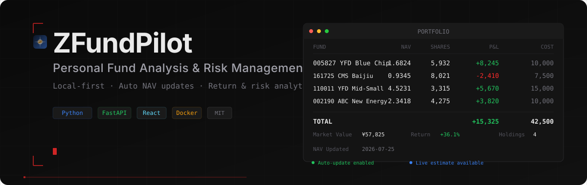
</p>

</div>

> ⚠️ For data analysis and risk management only. No automated trading, no price predictions, no investment advice.
>
> 🚧 This project is under active development. Features may change and some may break. If you encounter issues or have ideas, please [submit an Issue](https://github.com/Euzohn/ZFundPilot/issues). Contributions welcome!

---

## Screenshots

<div align="center">
  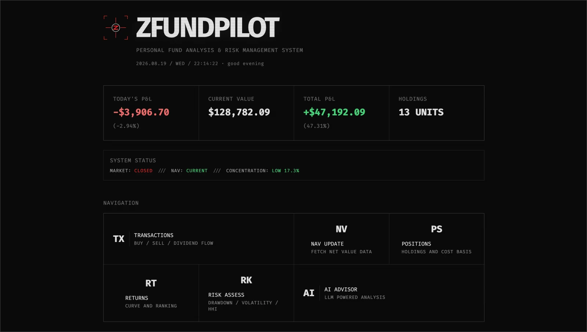
  <p><b>Home Portal</b> — Dark tactical terminal style, key metrics + quick navigation + system status</p>
  <br>
  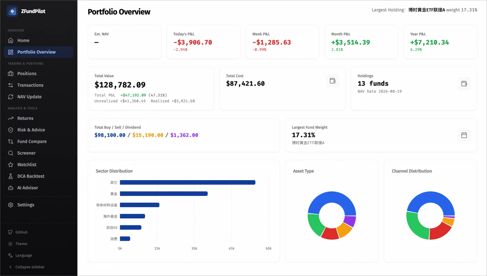
  <p><b>Portfolio Overview</b> — Cost, market value, P&L at a glance + asset/channel/sector distribution charts</p>
  <br>
  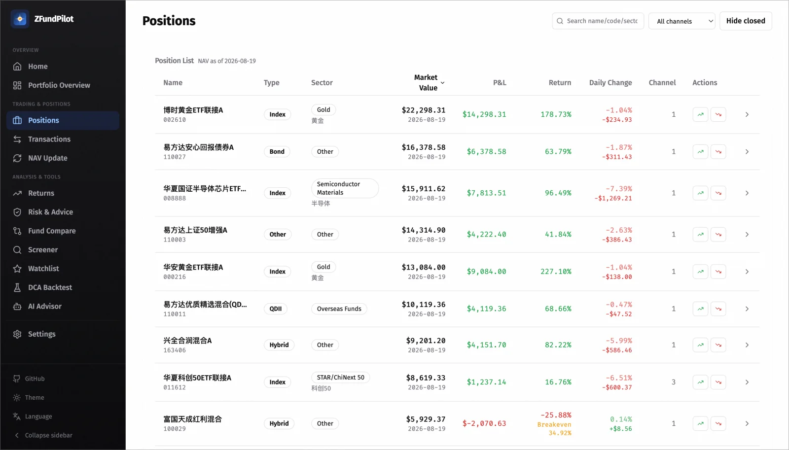
  <p><b>Positions</b> — Cross-channel merged view per fund, with NAV freshness indicator</p>
  <br>
  <details>
<summary>More Screenshots (Click to expand)</summary>

  <br>
  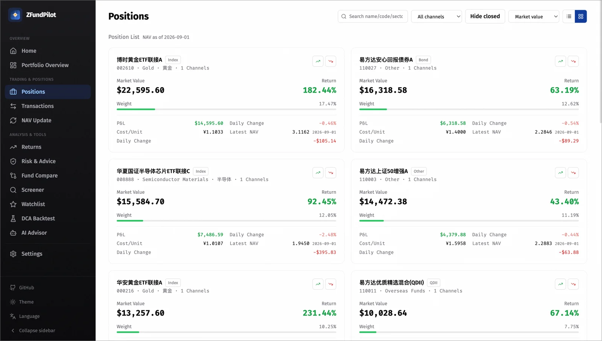
  <p><b>Positions (Grid View)</b> — Bento large cards with allocation bars + cost/estimate/P&L + holding days/sector</p>
  <br>
  <table>
    <tr>
      <td>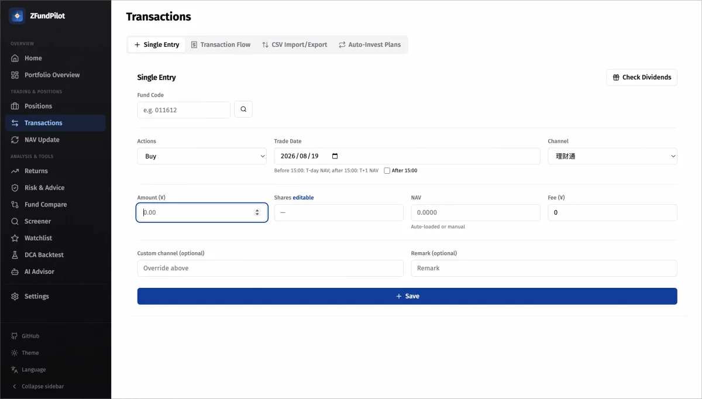</td>
      <td>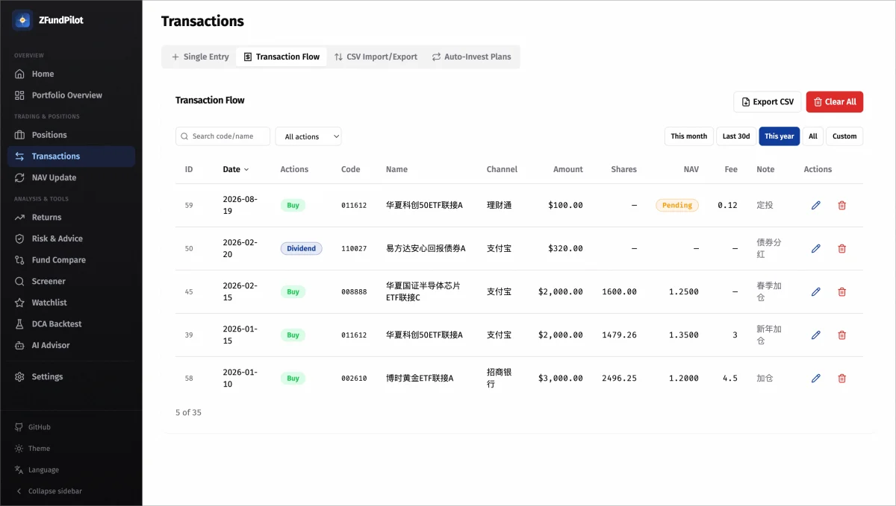</td>
    </tr>
    <tr>
      <td>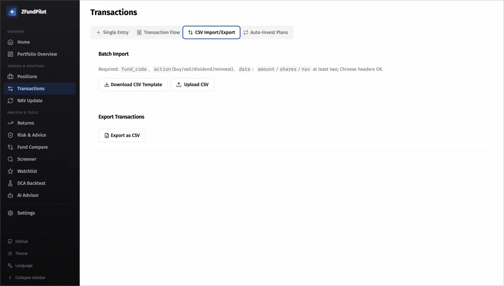</td>
      <td>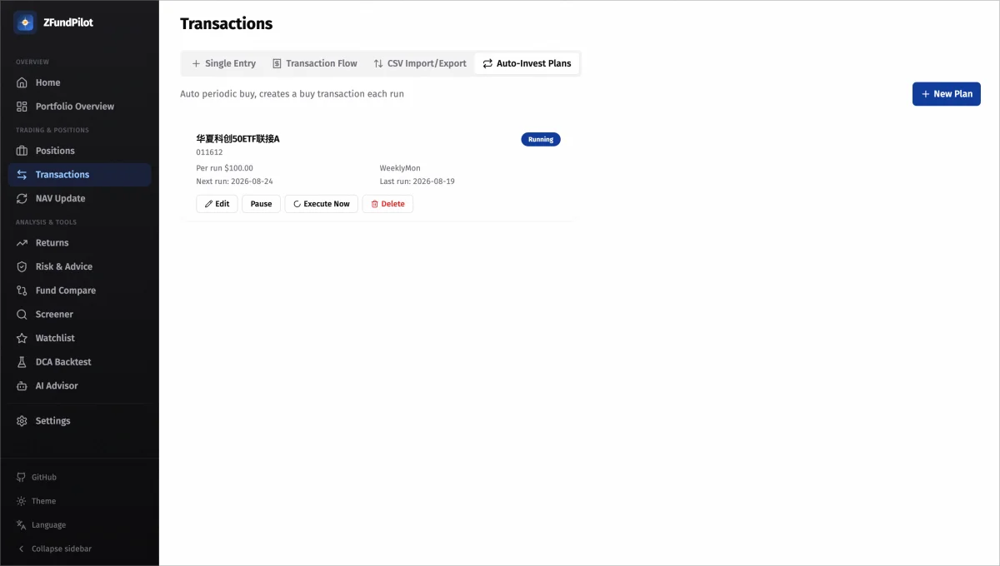</td>
    </tr>
  </table>
  <p><b>Transactions</b> — Trade entry, transaction log, CSV import/export, screenshot import (AI vision recognition of trades/holdings), auto-invest plans</p>
  <br>
  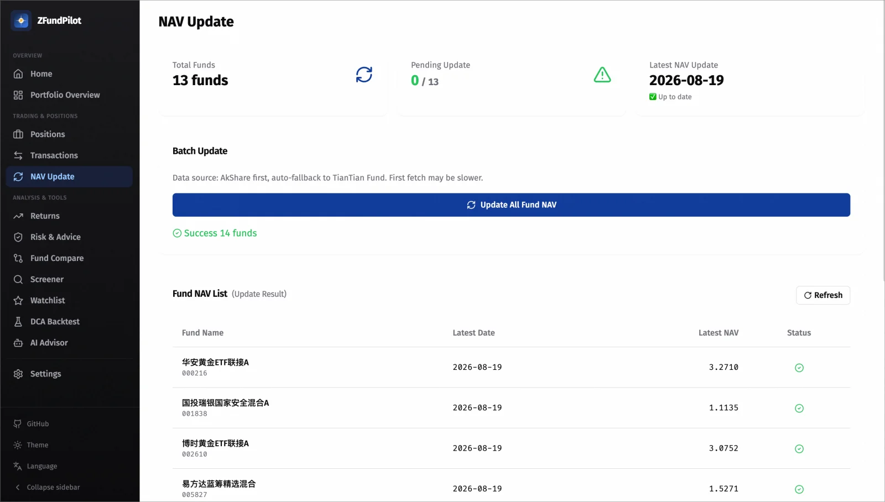
  <p><b>NAV Updates</b> — AkShare primary, Tiantian Fund fallback, bulk NAV history fetch</p>
  <br>
  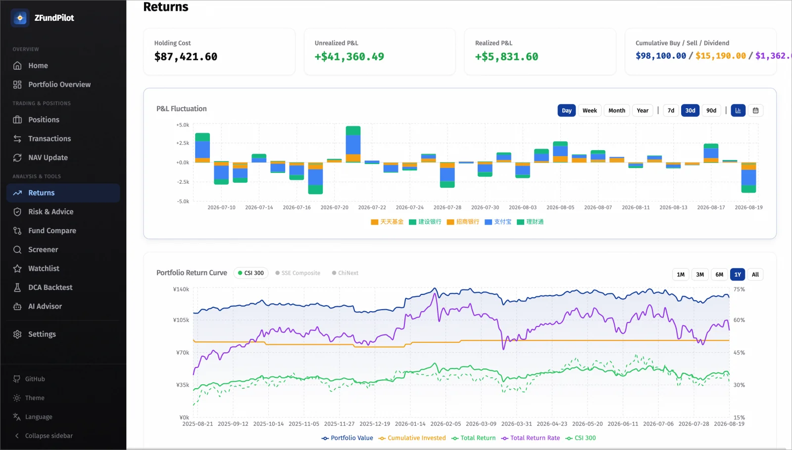
  <p><b>Return Analysis</b> — Unrealized/realized P&L, portfolio curve, benchmark comparison, day/week/month/year calendar view</p>
  <br>
  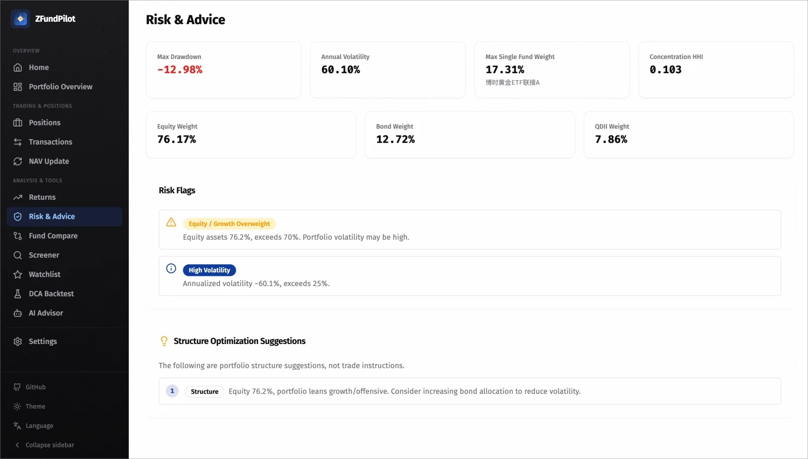
  <p><b>Risk Assessment</b> — Max drawdown, annualized volatility, concentration HHI, structure breakdown</p>
  <br>
  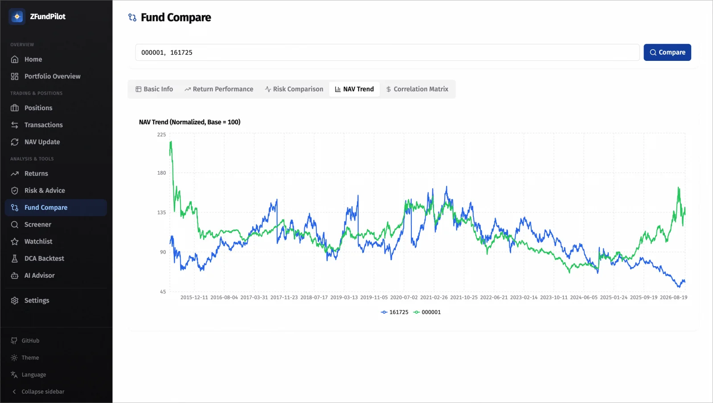
  <p><b>Fund Compare</b> — Multi-dimensional side-by-side comparison + NAV curve overlay + correlation matrix</p>
  <br>
  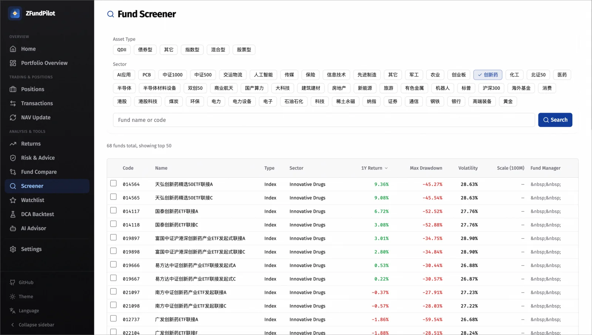
  <p><b>Fund Screener</b> — Full market filter + top 30 enriched metrics, sortable columns</p>
  <br>
  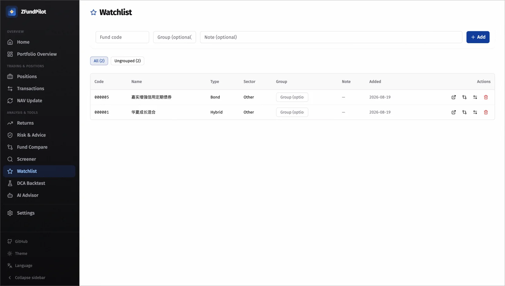
  <p><b>Watchlist</b> — Track funds of interest, held funds show "Held" badge, sortable columns</p>
  <br>
  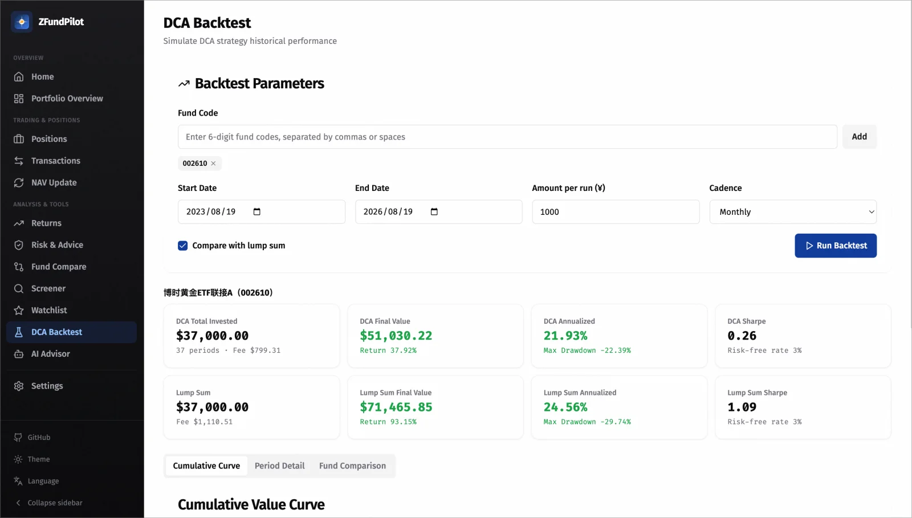
  <p><b>DCA Backtest</b> — DCA vs lump-sum, XIRR annualized return, max drawdown, Sharpe ratio</p>
  <br>
  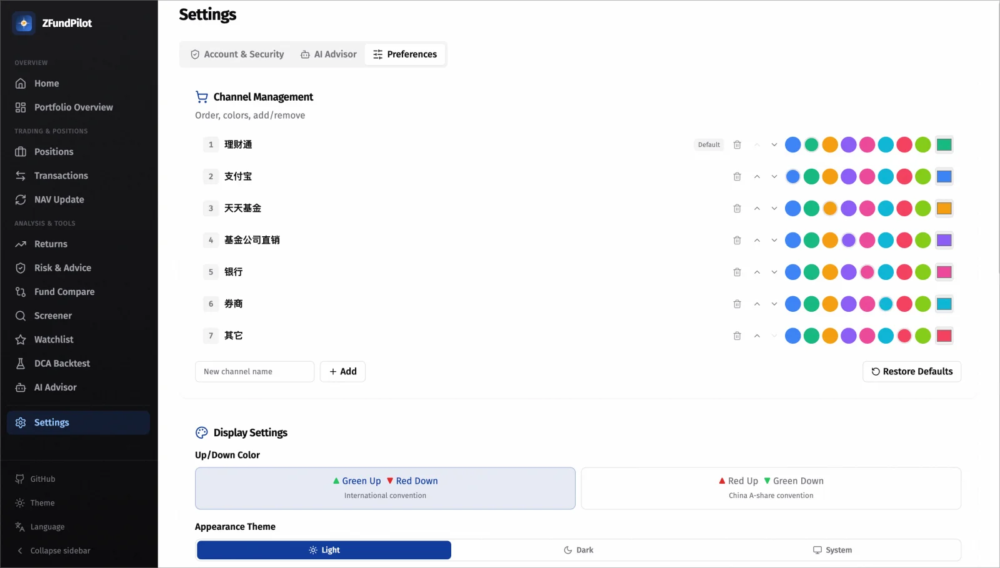
  <p><b>Settings</b> — Account management, AI config, preferences, audit log</p>

</details>
</div>

## What is this

ZFundPilot is a **self-hosted Chinese mutual fund portfolio analysis tool**. Record every transaction, auto-fetch NAV data, calculate returns and risks, and get structure-based rebalancing advice. It is not a trading system — no automated buying/selling, no broker integration.

## Why it's different

- **Self-hosted, your data stays yours** — Run locally or via Docker. Data never leaves your machine
- **Built for the Chinese fund market** — Data sourced from AkShare and Tiantian Fund. Full-dimension analysis including live estimates, fee calculation, and sector classification
- **Data-driven, not hype-driven** — No leaderboards, no marketing pitches. Just quantitative metrics based on your actual portfolio
- **AI-assisted, not AI-decided** — OpenAI-compatible API provides context-aware answers. Recommendations are for reference only — you make the decisions

## Quick Start

### Docker (Fastest)

```bash
docker compose up -d --build
```

Open http://localhost:8000

### Local Development

```bash
# Backend API
pip install -e .
uvicorn zfundpilot.api:app --reload --port 8000

# Frontend dev server (separate terminal)
cd frontend && npm install && npm run dev
```

See [DEPLOY.md](DEPLOY.md) for detailed deployment guide.

## Feature Highlights

### Transactions & Holdings

- **Transaction Management** — Record buys/sells/dividends/reinvests. Form entry + CSV bulk import/export + full backup ZIP export
- **Multi-Channel Support** — Alipay, WeChat, Tiantian Fund, etc. Same fund tracked separately across channels
- **Auto Fee Lookup** — Fetches purchase/redemption fee rates from Tiantian Fund on entry. FIFO-based redemption fee calculation. Manual override supported
- **Auto Portfolio Aggregation** — Moving weighted average cost by fund + channel. Realized P&L transferred on sell
- **Position Views** — Toggle between list view (cross-channel detail + NAV freshness) and grid view (Bento cards with allocation bars, cost/estimate/P&L, holding days/sector)

### Analysis & Estimates

- **NAV Updates** — AkShare primary, Tiantian Fund fallback. Auto-fetch fund name/type/sector on code entry
- **Return Analysis** — Unrealized/realized P&L, portfolio return curve, benchmark comparison (CSI 300 / SSE Composite / ChiNext, data persisted for offline use), return rate ranking, day/week/month/year calendar view, stacked bar by channel
- **Live Estimates** — Real-time fund change estimates during trading hours. Auto-invalidates when actual NAV is published. Auto-falls back to fundgz API (6 threads) when primary source is unavailable, with index/ETF fallback tier
- **Fund Compare** — Multi-dimensional side-by-side comparison + NAV curve overlay + correlation matrix. Global compare basket with add/remove, badge count in nav bar
- **Fund Screener** — Filter from full market universe by type/sector/keyword, top 30 auto-enriched with returns/risk metrics, sortable columns, one-click add to compare or watchlist
- **Watchlist** — Track funds of interest, held funds show a "Held" badge, sortable columns, auto-fetch name/type/sector on add, quick links to detail/compare/buy
- **Screenshot Import** — Upload purchase record or holdings screenshots for AI vision model recognition. Holdings reconcile mode compares recorded shares by channel, one-click generates adjustment transactions. Vision model independently configurable (Zhipu GLM-4V / Qwen VL / GPT-4o / Kimi Vision), auto-matches fund codes from names when screenshots lack them
- **Fund Details** — NAV trend + asset allocation pie chart + top 10 holdings + peer ranking trend + fund profile (manager/assets/inception date) + risk level + quick actions (compare/watchlist/buy/sell/auto-invest)
- **DCA Backtest** — Simulate DCA (monthly/biweekly/weekly) vs lump-sum with historical NAV data. Calculates XIRR, max drawdown, Sharpe ratio
- **Auto-Invest Plan** — Set up daily/weekly/biweekly/monthly auto-buy, auto-skip non-trading days, auto-calculate fees, T+1 NAV backfill

### Risk & Optimization

- **Risk Analysis** — Max drawdown, annualized volatility, concentration (HHI), structure breakdown, risk flags
- **Rebalancing Advice** — Structure-based optimization suggestions (not trading signals)
- **Take-Profit / Stop-Loss Alerts** — Automatically checks fund returns after NAV update and alerts when thresholds are hit. State machine prevents repeats: after triggering, returns must fall back below the reset ratio before re-arming, avoiding repeated alerts after partial profit-taking. Independent take-profit/stop-loss toggles, globally configurable thresholds. Confirm jumps to transaction page pre-filled with sell
- **Dividend Auto-Detection** — Scans held funds for unrecorded dividends daily at 09:30, dialog pre-fills for quick recording. Phantom alert auto-cleanup: marks invalid alerts as ignored when source data is corrected

### AI Assistant

- **AI Advisor Chat** — Configure any OpenAI-compatible API (Zhipu/Kimi/Qwen/DeepSeek). AI auto-searches the web for latest news + analyzes your portfolio context
- **AI-Assisted Transactions** — Describe a trade in natural language, AI parses structured data with auto fee calculation, confirm and save

### Security & Customization

- **Password Auth** — Username + password login, HMAC-signed token, bcrypt password hashing, login rate limiting
- **API Key Encryption** — AI API key encrypted at rest (Fernet AES-128-CBC + HMAC-SHA256)
- **Audit Log** — Sensitive operations logged, viewable in Settings
- **Language Switch** — Full UI supports Chinese/English toggle, switch from sidebar, data format (¥/$) adapts automatically
- **Color Theme Switch** — Toggle between "Green-up/Red-down (International)" and "Red-up/Green-down (A-share)"
- **Dark Mode** — light/dark/system three-way toggle, defaults to system preference
- **Channel Color Customization** — Preset palette + custom color picker, synced server-side
- **Custom Keyword Mapping** — Sector/type classification rules are user-editable, synced across devices

## Usage Guide

1. **Transactions** → Enter fund code, auto-fill info, select action type and channel, save
2. **NAV Update** → Click "Update All NAV" to fetch historical data, or enable auto-scheduler
3. **Portfolio & Analysis** → View positions, return curves, risk metrics, and structural advice
4. **AI Assistant** → Configure API to chat for advice or have AI enter trades for you

> Buy: enter amount (NAV auto-filled, shares auto-calculated). Sell: enter shares (amount auto-calculated). Dividend: enter amount. Reinvest: enter shares + NAV.

## Tech Stack

| Layer | Technology |
|---|---|
| Frontend | React 18 + Vite + TypeScript + Tailwind + shadcn/ui |
| Backend | FastAPI + SQLite + Pandas |
| Data Source | AkShare + Tiantian Fund |
| AI | OpenAI-compatible API (Zhipu / Kimi / Qwen / DeepSeek) |
| Deployment | Docker / Uvicorn |

## Project Structure

<details>
<summary>Click to expand</summary>

```text
ZFundPilot/
├── pyproject.toml        # Package config, dependencies, Ruff/Pytest config
├── Dockerfile            # Multi-stage Docker image build (TZ=Asia/Shanghai built-in)
├── docker-compose.yml    # Docker deployment
├── .github/workflows/    # GitHub Actions CI/CD
│   └── ci.yml            #   ruff → pytest → tsc → build
├── src/zfundpilot/       # Python package
│   ├── __init__.py
│   ├── config.py         # Global config, channels, risk thresholds, auth/AI config
│   ├── models.py         # Data structures (Fund / Transaction / Position)
│   ├── db.py             # SQLite database operations
│   ├── fetch_fund.py     # NAV fetching + name/type/sector + fee lookup + holdings/ranking/profile
│   ├── fetch_estimate.py # Real-time fund estimate (AkShare)
│   ├── compare.py        # Fund comparison (returns/risk/correlation)
│   ├── fund_filter.py    # Fund filter (full market universe + metrics enrichment)
│   ├── analysis.py       # Transaction aggregation, return calculation, curve
│   ├── risk.py           # Risk analysis (drawdown/volatility/concentration)
│   ├── rebalance.py      # Portfolio rebalancing advice
│   ├── backtest.py       # DCA backtest
│   ├── auto_invest.py    # Auto-invest plan execution
│   ├── crypto.py         # Field encryption (Fernet)
│   ├── data_io.py        # CSV import/export + backup ZIP
│   ├── api.py            # FastAPI REST API (37+ routes + auth middleware)
│   ├── ai.py             # AI advisor chat (portfolio context + web search)
│   └── scheduler.py      # APScheduler NAV update + auto-invest + dividend check + TP/SL check
├── tests/                # Pytest test suite (103 tests)
│   ├── conftest.py       #   Shared fixtures
│   └── test_*.py         #   9 test modules
├── data/
│   ├── fund.db           # SQLite database (auto-generated)
│   ├── auth.json         # Password hash / token secret (auto-generated)
│   ├── ai_config.json    # AI model config (auto-generated)
│   └── sector_map.json   # Fund code → sector mapping (auto-maintained)
├── frontend/             # React + Vite + TypeScript + Tailwind + shadcn/ui
│   ├── src/
│   │   ├── pages/        # 13 pages
│   │   ├── components/   # Layout + shadcn/ui + business components
│   │   ├── i18n/         # LanguageContext + zh.ts + en.ts translation files
│   │   ├── api/          # Typed API client + streamChat (SSE)
│   │   └── lib/          # Utilities (format/actionLabels/rangeLabels lang-aware)
│   └── dist/             # Build output (production mode)
├── assets/readme/        # README visual assets
└── .env.example           # Environment variable template
```

</details>

## Environment Variables

<details>
<summary>Click to expand</summary>

| Variable | Default | Description |
|----------|---------|-------------|
| `ZFUNDPILOT_USERNAME` | `admin` | Used only on first launch for login username |
| `ZFUNDPILOT_PASSWORD` | empty | Used only on first launch for password hash (bcrypt) |
| `ZFUNDPILOT_SECRET` | auto-generated | Used only on first launch for token signing key |
| `ZFUNDPILOT_NAV_CRON` | `0 21 * * 1-5` | Cron expression for scheduled NAV updates |
| `ZFUNDPILOT_HOME` | project root | Location of the `data/` directory |
| `ZFUNDPILOT_TRUSTED_PROXIES` | empty | Trusted proxy CIDRs (only needed behind Nginx/Caddy) |
| `CONTAINER_NAME` | `zfundpilot` | Docker container name. Set a different value per instance for multi-instance deployments (see DEPLOY.md) |

</details>

## Security

<details>
<summary>Click to expand</summary>

| Measure | Description |
|---------|-------------|
| Password Hashing | bcrypt (cost=12), backward-compatible with SHA-256, auto-upgraded on login |
| Login Rate Limiting | 5 failed attempts within 5 min → 15 min lockout |
| Token Auth | HMAC-SHA256 signed tokens, 7-day expiry, invalidated on password change |
| Error Sanitization | Upstream AI errors logged server-side, never exposed to client |
| Trusted Proxy | `ZFUNDPILOT_TRUSTED_PROXIES` controls X-Forwarded-For trust. Empty by default |

- **IP-only / LAN**: Set a password. Default config is safe
- **Domain + HTTPS**: Use Caddy for automatic TLS. Configure `TRUSTED_PROXIES` for correct client IP

</details>

## CSV Column Reference (Transactions)

<details>
<summary>Click to expand</summary>

| Column | Description | Required |
|--------|-------------|----------|
| fund_code | Fund code | ✅ |
| action | buy/sell/dividend/reinvest (also accepts Chinese) | ✅ |
| date | Trade date YYYY-MM-DD | ✅ |
| amount | Trade amount | Required for buy/dividend |
| shares | Trade shares | Required for sell/reinvest |
| nav | NAV at trade | Auto-filled if two of three provided |
| fee | Transaction fee | |
| channel | Channel | |
| note | Note | |

Any two of `amount` / `shares` / `nav` can be provided; the third is auto-calculated. Chinese headers supported.

</details>

## Risk Thresholds

<details>
<summary>Click to expand</summary>

| Metric | Default Threshold |
|--------|-------------------|
| Single fund weight (high / very high) | 20% / 40% |
| Minimum bond allocation | 10% |
| QDII overseas exposure | 30% |
| Equity overweight | 70% |
| High-risk drawdown | -15% |
| High volatility | 25% |

Default thresholds defined in `config.py` under `RiskThresholds`, adjustable as needed.

</details>

## Changelog

See [CHANGELOG.md](CHANGELOG.md).

## Contributing

Welcome to submit [Issues](https://github.com/Euzohn/ZFundPilot/issues) for bugs or feature requests, and [Pull Requests](https://github.com/Euzohn/ZFundPilot/pulls) to help improve the project.

**Contact**: [Zongid@outlook.com](mailto:Zongid@outlook.com)

## License

MIT License © 2025 Euzohn

See [NOTICE.md](./NOTICE.md) for data source attribution and compliance terms.

---

## Star History

[](https://star-history.com/#Euzohn/ZFundPilot&Date)